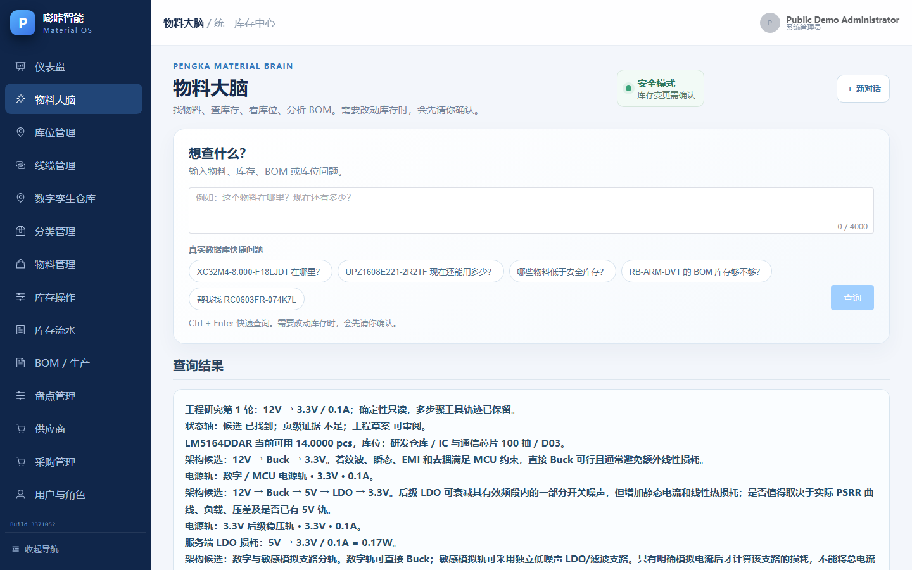
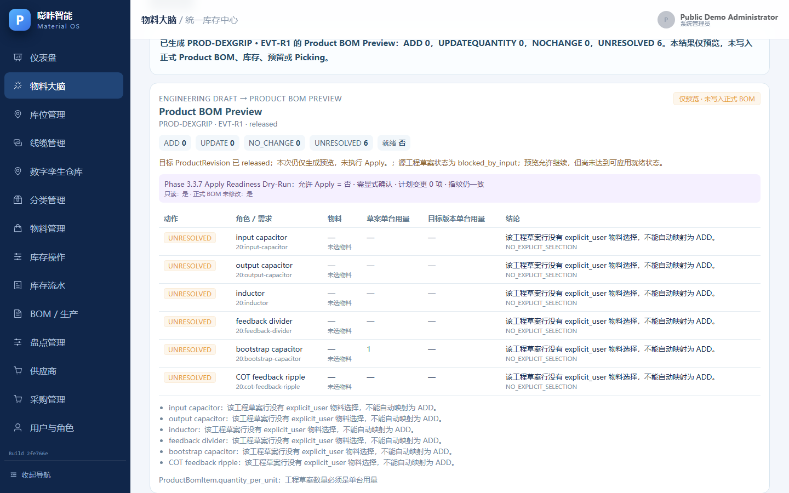
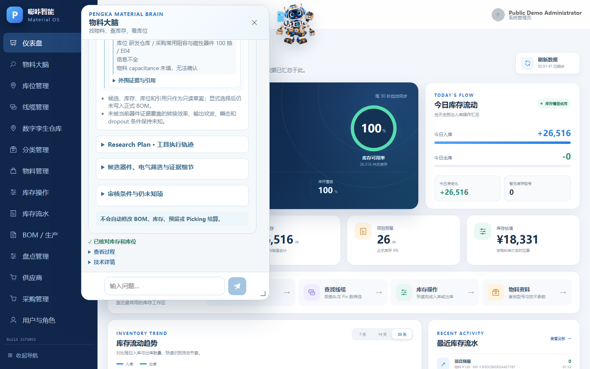
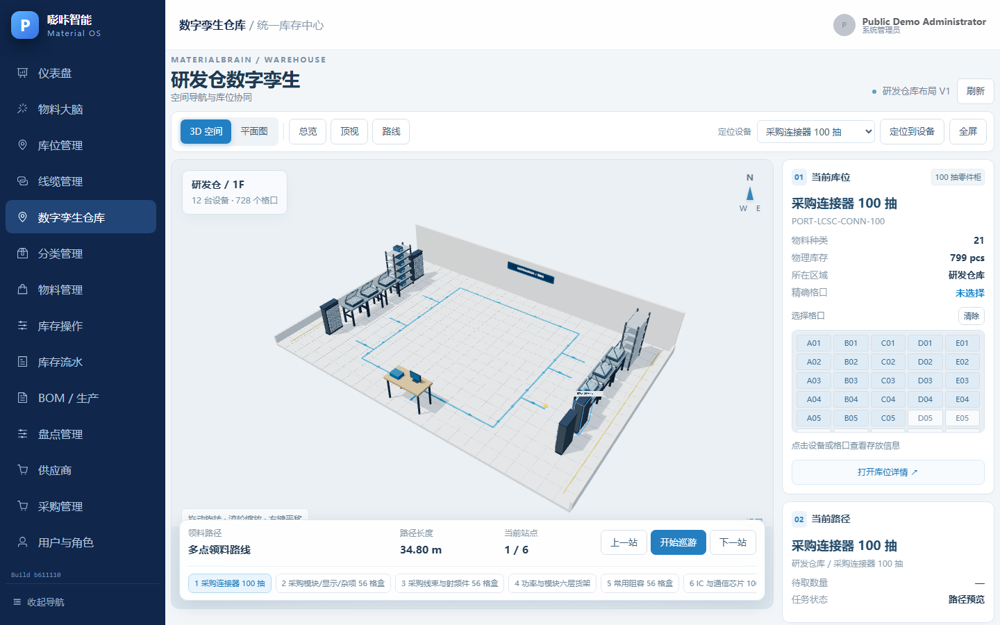

<div align="center">

# MaterialBrain

**Provenance-aware engineering material intelligence and warehouse workflow platform**

Deterministic engineering workflows, grounded AI assistance, Engineering BOM readiness, Product BOM preview, real-time inventory/location truth, and guided warehouse execution in one self-hosted system.

[](LICENSE)
[](https://github.com/Yvniverse/MaterialBrain-public/actions/workflows/public-ci.yml)


[中文说明](README.zh-CN.md) · [Architecture](docs/architecture/README.md) · [Security](SECURITY.md) · [Contributing](CONTRIBUTING.md)

</div>

## Why MaterialBrain?

Hardware engineering teams rarely have a single source of truth that connects **datasheet evidence, engineering constraints, material candidates, stock/location facts, product BOMs, and warehouse execution**. MaterialBrain is an experiment in closing that gap without letting an LLM become the source of business truth.

The key design rule is simple:

> **The server owns deterministic facts and state transitions. The model may plan, explain, and compose grounded results, but it cannot invent inventory, selection, BOM, or transaction truth.**

That principle is reflected throughout the architecture: typed task contracts, allowlisted tools, provenance-aware material attributes, server-owned selection context, read-only BOM previews, guarded inventory transactions, and exact-SHA release qualification.

## Highlights

| Area | What MaterialBrain does |
| --- | --- |
| **Engineering Agent** | Two UI surfaces (floating robot and `/agent`) share the same structured server result contract. Follow-ups keep typed context instead of relying only on chat history. |
| **Engineering Evidence** | Datasheet/page anchors and material attribute provenance keep vendor facts separate from model prose. |
| **Power + Engineering BOM** | Builds rails/stages/requirements, performs deterministic loss calculations, grounds compatible material candidates, supports explicit draft selection, and reports completeness. |
| **Product BOM Preview** | Computes read-only `ADD / UPDATE_QUANTITY / NO_CHANGE / UNRESOLVED` diffs and apply-readiness preconditions without mutating the formal BOM. |
| **Inventory + Location** | Transactional stock operations, reservations, movements, low-stock information, visual locations, and audit history. |
| **Warehouse Twin + Picking** | Warehouse map graph, location bindings, route planning, pick tasks/allocations, and guided picking. |
| **Governance** | RBAC, CSRF/session security, proposal/approval boundaries, idempotency, audit logs, backups, project memory guard, and exact-SHA deployment evidence. |

## Screenshots

<table>
<tr>
<td width="50%"></td>
<td width="50%"></td>
</tr>
<tr>
<td align="center"><b>Grounded Engineering BOM selection</b><br/>Requirement → candidate → explicit draft selection → completeness</td>
<td align="center"><b>Product BOM Preview</b><br/>Read-only diff, blockers, provenance and apply-readiness</td>
</tr>
<tr>
<td width="50%"></td>
<td width="50%"></td>
</tr>
<tr>
<td align="center"><b>Two agent surfaces, one server truth</b></td>
<td align="center"><b>Warehouse twin and guided execution</b></td>
</tr>
</table>

## Runtime Architecture

<p align="center">
  
</p>

MaterialBrain runs as a self-hosted web application. Nginx exposes a single browser entry point, Vue provides the interactive UI, FastAPI owns authentication and business APIs, deterministic domain services own business facts, PostgreSQL stores durable state, and the Qwen model pool is used only behind a bounded agent layer.

More detailed diagrams are available in [`docs/architecture/`](docs/architecture/README.md):

1. Runtime overview
2. Backend subsystems and truth boundaries
3. Agent request workflow
4. Engineering intelligence dataflow
5. Warehouse twin and guided picking
6. Exact-SHA release and qualification lifecycle

## Engineering Flow

A typical engineering-material question follows this path:

```text
Engineering question
        │
        ▼
Typed workpoint + requirement
        │
        ├── managed engineering evidence
        └── structured material attributes + provenance
        │
        ▼
Component-class gate + constraint matcher
        │
        ▼
Grounded candidate set
        │
        ▼
Explicit engineering-draft selection
        │
        ▼
Completeness / blockers
        │
        ▼
Read-only Product BOM Preview
        │
        ▼
Apply-readiness dry-run (still no formal BOM write)
```

### Example production-style questions

```text
I need a 12 V → 5 V Buck → 3.3 V LDO supply at 100 mA.
Show the loss at each stage, Engineering BOM completeness,
and the current LM5164 candidate stock/location.
```

```text
For the LM5164 bootstrap capacitor, compare materials that satisfy
2.2 nF, rated voltage >= 50 V, and X7R. Show spec provenance,
stock provenance, location provenance, and do not select one for me.
```

```text
Preview the current Engineering BOM against product PROD-DEXGRIP / EVT-R1.
Tell me what would be added, what quantity would change,
what is unchanged, and what is still unresolved. Do not apply anything.
```

## Design Principles

### 1. Deterministic truth before model narration

Inventory quantity, location, power-loss calculations, candidate match status, selected material IDs, completeness, and Product BOM diffs are produced by server-side services. Model-generated narrative is checked against structured truth before it is exposed to the user.

### 2. Grounding is more than retrieval

Material identity, specification, stock, and location have independent provenance. A portfolio/demo stock number is not presented as field-counted inventory, and missing attributes remain missing instead of being silently guessed by the model.

### 3. Selection is not the same as availability

A material may be compatible and in stock without being selected. Engineering draft selection changes only after an explicit user action and is stored as typed server-owned context.

### 4. Preview before mutation

Engineering BOM → Product BOM remains read-only in the public milestone documented here. Preview and apply-readiness dry-run can explain proposed changes and preconditions, but they do not mutate the formal Product BOM.

### 5. Release evidence is exact-SHA evidence

CI, Memory Guard, backups, runtime identity, browser evidence, and qualification metadata are expected to refer to the same candidate commit. Old screenshots or old green CI runs do not qualify a new build.

## Tech Stack

**Backend**

- Python 3.12
- FastAPI
- SQLAlchemy + Alembic
- PostgreSQL 17
- LangGraph-style agent orchestration
- Qwen model pool (`qwen3.7-plus-2026-05-26` primary, certified Max fallback in the current internal configuration)

**Frontend**

- Vue 3 + TypeScript
- Pinia + Vue Router
- Element Plus
- ECharts
- Three.js
- Vitest + Playwright

**Operations**

- Docker Compose
- Nginx
- PostgreSQL + file backup manifests
- GitHub Actions
- Exact-SHA runtime metadata and qualification tooling

## Quick Start

### Prerequisites

- Docker Engine 24+ and Docker Compose v2
- For source development: Python 3.12, Node.js 22, pnpm 11

### 1. Configure

```bash
git clone https://github.com/Yvniverse/MaterialBrain-public.git
cd MaterialBrain
cp .env.example .env
```

At minimum, set a strong PostgreSQL password and keep `DATABASE_URL` consistent with it. Do not commit `.env`.

The warehouse application can run without an LLM. To enable the engineering agent, configure the supported backend model credentials in `.env` and set `AGENT_ENABLED=true`.

### 2. Start

```bash
docker compose up -d --build
docker compose exec backend alembic upgrade head
docker compose exec backend python scripts/create_admin.py
docker compose ps
```

Open `http://localhost` (or the configured `WEB_PORT`).

### 3. Verify

```bash
curl http://localhost/api/v1/health
```

For LAN deployment, backup/restore, security hardening, and production notes, see the documents under [`docs/`](docs/).

## Development

Backend:

```bash
cd backend
python -m venv .venv
# activate the venv, then:
pip install -r requirements.txt
python -m ruff check app scripts tests
python -m pytest
```

Frontend:

```bash
cd frontend
pnpm install --frozen-lockfile
pnpm lint
pnpm test
pnpm build
```

The public repository template also includes a GitHub-hosted CI workflow so external pull requests do not depend on the maintainer's private self-hosted runner.

## Repository Layout

```text
backend/        FastAPI, domain services, agent runtime, migrations and tests
frontend/       Vue 3 application, structured agent cards and browser tests
nginx/          same-origin reverse proxy
deploy/         backup / restore / deployment utilities
docs/           architecture, API, security and operational documentation
tools/          project/release qualification utilities
docker-compose.yml
```

## Safety Boundaries

MaterialBrain deliberately keeps several boundaries explicit:

- LLM/API keys stay server-side.
- Inventory writes go through guarded transactional services.
- Agent write proposals require explicit server-side authorization/approval paths.
- Engineering draft selection does not automatically write the formal Product BOM.
- Demo/synthetic stock provenance must remain visible when demo data is used.
- Test/UAT fixtures must never target the default production database.

## v0.1.0 Scope

The first public release focuses on grounded engineering assistance, auditable material/BOM workflows, and read-only apply-readiness. Write automation remains intentionally conservative:

- [x] Grounded engineering queries and deterministic tool routing
- [x] Engineering evidence and material provenance
- [x] Power architecture + multi-rail Engineering BOM draft
- [x] Explicit selection truth and completeness
- [x] Read-only Product BOM Preview
- [x] Apply-readiness dry-run without formal BOM mutation
- [x] Warehouse twin and guided picking foundations
- [ ] Transactional Product BOM apply with explicit human confirmation
- [ ] Broader component-library enrichment and derating rules

## Portfolio / Engineering Notes

MaterialBrain is published as a curated engineering portfolio and open-source snapshot. The public repository intentionally excludes private development history, local runtime artifacts, credentials, raw evaluation telemetry, and third-party files that are not cleared for redistribution.

The screenshots and architecture diagrams in this repository are generated from the tagged public release. Demo or synthetic inventory/location data is labeled through provenance metadata and should not be interpreted as live warehouse stock.

## Contributing

Contributions are welcome. Please read [`CONTRIBUTING.md`](CONTRIBUTING.md) before opening a pull request. Security issues should follow [`SECURITY.md`](SECURITY.md), not a public issue.

## License

Copyright © 2026 MaterialBrain contributors.

Licensed under the **Apache License, Version 2.0**. See [`LICENSE`](LICENSE) and [`NOTICE`](NOTICE).

Third-party dependencies, vendor datasheets, logos, screenshots, hardware assets, and imported evidence remain subject to their own licenses or redistribution terms; they are not relicensed merely by being referenced by MaterialBrain.
