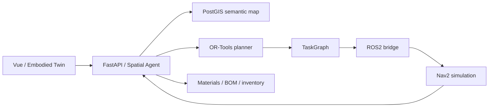

# MaterialBrain

**Spatial agents, engineering materials, and robotic warehouse workflows.**

MaterialBrain connects evidence-backed material decisions, inventory locations, a PostGIS semantic map, constrained mission planning, and ROS2/Nav2 simulation in a self-hosted application. The server computes spatial and business facts; the Agent turns requests into structured plans that people can inspect and execute.

[](https://github.com/Yvniverse/MaterialBrain-public/actions/workflows/public-ci.yml)
[](LICENSE)

[中文](README.zh-CN.md) · [Architecture](docs/architecture/README.md) · [Spatial Agent](docs/SPATIAL_AGENT.md) · [Robotics](docs/ROBOTICS.md) · [WarehouseBench](docs/WAREHOUSEBENCH.md)

## v0.2 features

| Component | What it provides |
| --- | --- |
| Semantic spatial map | Versioned local-metric geometry, zones, affordances, route edges, registered docks, and expiring overlays in PostGIS. |
| Mission planner | OR-Tools multi-stop ordering with graph restrictions, service times, payload capacity, time windows, battery reserve, and optional return home. |
| Spatial Agent | Typed navigation context, registered goal resolution, permission-filtered tools, and inspectable mission cards. |
| TaskGraph | Explicit navigation, arrival, scan, handoff, cancellation, and replanning state with recorded observations. |
| ROS2/Nav2 | An optional Jazzy simulation bridge with a lattice planner, MPPI controller, readiness checks, and observed navigation feedback. |
| Embodied Twin | Interactive map, robot pose, obstacles, routes, and remaining mission work at `/warehouse-lab`. |
| Engineering workflows | Datasheet evidence, material selection, Engineering BOM readiness, read-only Product BOM preview, inventory, and guided picking. |
| WarehouseBench and SFT | Seeded tasks, independent verification, replay, group-separated datasets, and an optional local-model LoRA training entrypoint. |



## Quickstart

Use Docker Engine with Compose v2. Source development uses Python 3.12, Node.js 22, and pnpm 11.

```bash
git clone --branch codex/public-v0.2-spatial-agent https://github.com/Yvniverse/MaterialBrain-public.git
cd MaterialBrain-public
cp .env.example .env
```

Set a PostgreSQL password in `.env` and update the matching `DATABASE_URL`. The default Compose project is `materialbrain_public_v02`, the browser port is `18080`, and file storage is local to this checkout at `./storage`.

```bash
docker compose -p materialbrain_public_v02 up -d --build
docker compose -p materialbrain_public_v02 exec backend python scripts/create_admin.py
docker compose -p materialbrain_public_v02 exec backend python scripts/register_spatial_map.py --expected-database-name materialbrain_public
```

The backend applies database migrations at startup. Open [http://localhost:18080](http://localhost:18080), log in, change the initial password, and open `/warehouse-lab`. The registration command adds the synthetic `MB-EMB-LAB-03` map without activating it as an operational warehouse or changing inventory.

Map queries and mission planning work without a model key. To use the natural-language Agent entrypoint, set `AGENT_ENABLED=true` in the backend environment. Spatial requests use deterministic planning; optional model credentials enable model-assisted business requests.

```bash
docker compose -p materialbrain_public_v02 --profile robotics up -d --build robotics
curl http://localhost:18080/api/v1/health
```

The optional robot service uses ROS domain `147` and internal port `8766`. Review its readiness before starting a mission. [Robotics](docs/ROBOTICS.md) covers startup, observation, recovery, and acceptance scenarios.

## Try a mission

1. Read the registered map and its revision. Select destinations such as `P-IC`, `P-SENSOR`, and `P-PWR`.
2. Request a multi-stop plan and inspect its ordered goals, constraints, and feasibility status.
3. Create the mission, review it in the Twin, and explicitly start execution.
4. Observe arrival, then confirm the required scan and handoff at each stop.
5. Add a simulation obstacle or cancel and replan from the observed pose. Completed handoffs remain recorded.

The provided execution service is a simulation: it reports `hardware_control=false` and `inventory_written=false`. Stock settlement uses separate authorized inventory and picking transactions. Planning estimates and observed navigation measurements have distinct fields.

## Develop and reproduce

[Contributing](CONTRIBUTING.md) explains isolated PostGIS tests, backend checks, and frontend checks. [WarehouseBench](docs/WAREHOUSEBENCH.md) documents planner comparisons, verified task generation, replay, episode export, and optional SFT. Keep generated datasets, model weights, checkpoints, and run traces outside committed source.

| Guide | Contents |
| --- | --- |
| [Architecture atlas](docs/architecture/README.md) | Six editable Mermaid views and source map. |
| [API](docs/API.md) | Authentication, CSRF, endpoints, and error contracts. |
| [Spatial Agent](docs/SPATIAL_AGENT.md) | Map registration, spatial queries, planning, and mission lifecycle. |
| [Robotics](docs/ROBOTICS.md) | ROS2/Nav2 simulation and execution observations. |
| [WarehouseBench](docs/WAREHOUSEBENCH.md) | Benchmark and training interfaces. |
| [Database](docs/DATABASE.md) | Schema, spatial frame, and migrations. |
| [Deployment](docs/DEPLOYMENT.md) | Configuration and runtime operation. |
| [Backup and restore](docs/BACKUP_RESTORE.md) | Database and file recovery. |

## License

The application and documentation use [Apache License 2.0](LICENSE). The ROS2 subpackage preserves its [MIT license](robot_bridge/ros2/LICENSE). Third-party dependencies and externally sourced material retain their own terms; see [NOTICE](NOTICE) and [Assets](docs/ASSETS.md).
