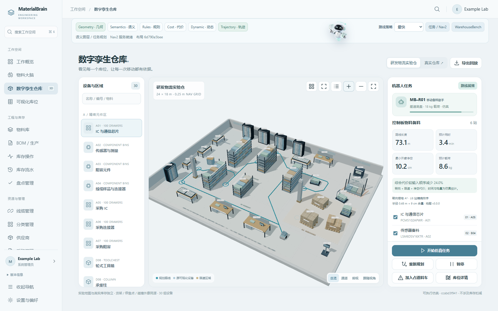
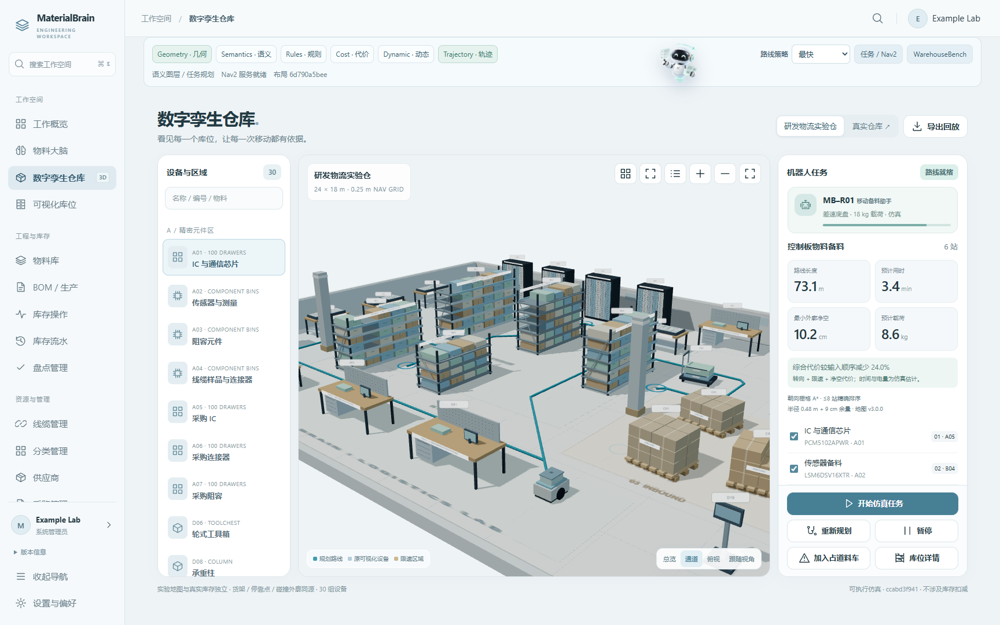
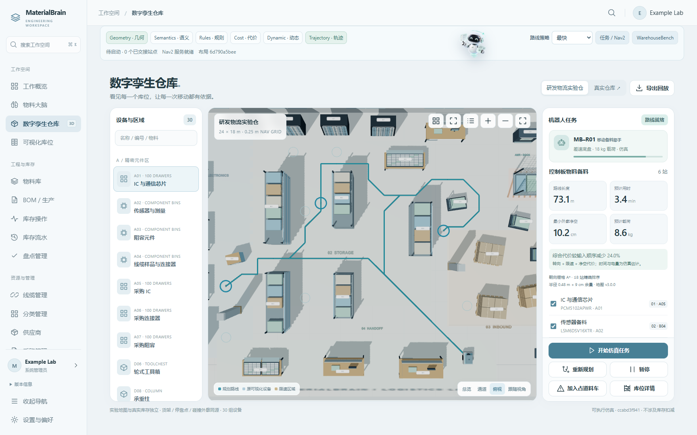
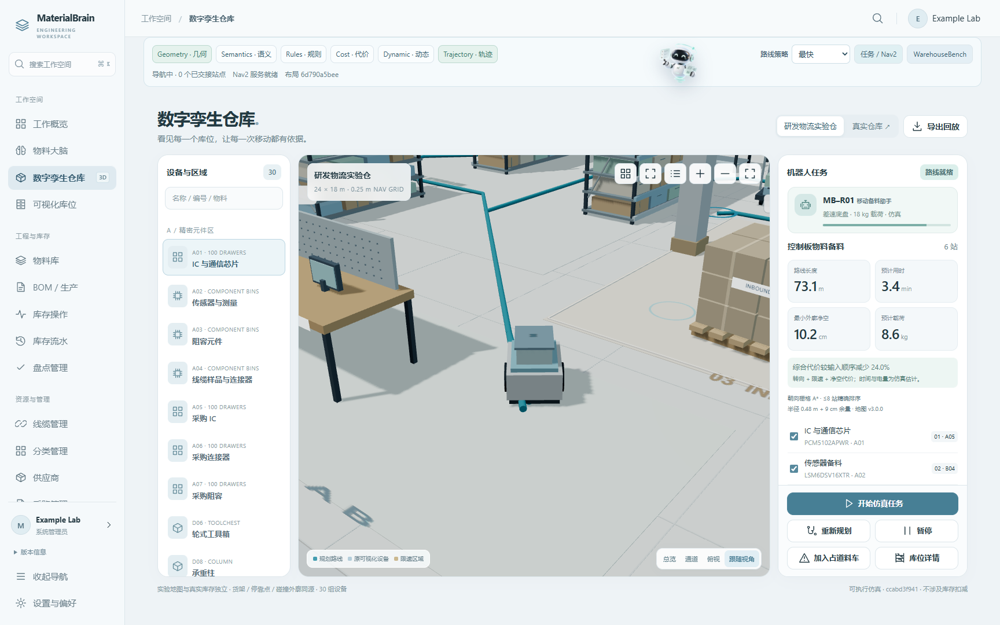
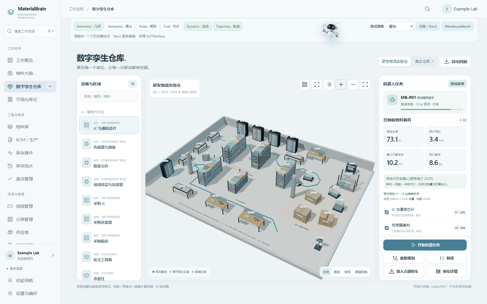
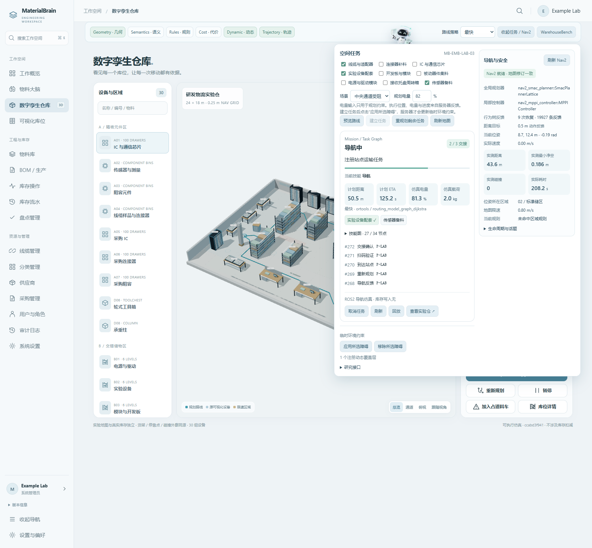
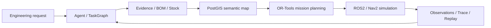
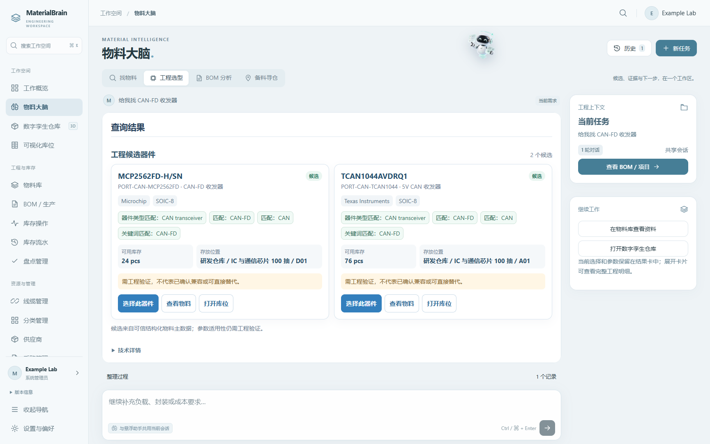
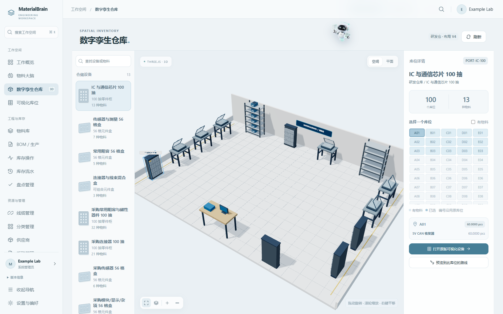

<div align="center">


# MaterialBrain

**Spatially grounded agents for engineering materials and embodied warehouse workflows.**

Connect engineering requests, datasheet evidence, BOMs, inventory locations, semantic maps and robot missions through typed tools and inspectable task state.

[](https://github.com/Yvniverse/MaterialBrain-public/actions/workflows/public-ci.yml)
[](LICENSE)
[](docs/ROBOTICS.md)

[**中文文档**](README.zh-CN.md) · [Architecture](docs/architecture/README.md) · [Spatial Agent](docs/SPATIAL_AGENT.md) · [Robotics](docs/ROBOTICS.md) · [WarehouseBench](docs/WAREHOUSEBENCH.md)

</div>


<div align="center"><sub>Research Logistics Lab · 3D equipment layout, spatial routes and mobile robot task state</sub></div>

<table><tr>
<td width="50%"><br/><sub>Aisle perspective · working areas and navigable corridors</sub></td>
<td width="50%"><br/><sub>Top-down perspective · registered route topology</sub></td>
</tr></table>

### Robot mission, replanning and handoff
<table><tr>
<td width="33%"><br/><sub>Robot-follow view</sub></td>
<td width="33%"><br/><sub>Dynamic route recovery</sub></td>
<td width="33%"><br/><sub>Registered station handoff</sub></td>
</tr></table>

## What is MaterialBrain?

MaterialBrain combines **engineering material intelligence** and **spatial robot task execution** in a self-hosted application. The Agent turns requests into typed tasks; server-side services own material facts, inventory transactions, geometric constraints and execution states. The workbench and floating assistant share conversation state across the workspace.



## What you can do

| Capability | In the application |
| --- | --- |
| **Engineering Material Agent** | Compare candidates using datasheet evidence, component attributes, electrical constraints, stock positions and BOM requirements. |
| **Inventory & Storage** | Manage materials, reservations and authorized stock transactions; inspect the 100-drawer cabinet, 56-bin organizer and six-level shelf. |
| **Semantic Digital Twin** | Explore the warehouse with Three.js, select equipment, locate storage slots and preview routes. |
| **Spatial Mission Planning** | Query a versioned PostGIS map and plan multi-stop tasks with payload, time-window, battery and semantic-route constraints. |
| **TaskGraph & Recovery** | Inspect typed skill results, navigation, scan/handoff, completed stops, cancellation and replanning state. |
| **Robotics Execution** | Run ROS2 Jazzy / Nav2 simulation with Smac State Lattice, MPPI and Behavior Tree recovery. |
| **WarehouseBench** | Generate seeded synthetic tasks, verify routes, export traces and use portable local-model SFT interfaces. |

## Engineering and inventory workspace
<table><tr>
<td width="50%"><br/><sub>Engineering material intelligence</sub></td>
<td width="50%"><br/><sub>Digital twin of registered storage locations</sub></td>
</tr></table>

The physical stockroom twin preserves the registered equipment and storage locations, including drawers, bins and shelves. The Research Logistics Lab is a versioned synthetic environment for multi-stop mission planning and ROS2/Nav2 execution. Planned routes and observed robot events are represented separately.

## Technology and execution boundaries

| Layer | Core technologies |
| --- | --- |
| Frontend | Vue 3, TypeScript, Element Plus, Three.js, ECharts |
| API & services | FastAPI, SQLAlchemy, PostgreSQL 17, PostGIS |
| Agent & planning | LangGraph, optional Qwen integration, typed tools, OR-Tools |
| Robotics | ROS 2 Jazzy, Nav2 State Lattice, MPPI, Behavior Tree |
| Training & evaluation | WarehouseBench, deterministic verification, replay, PyTorch / PEFT SFT interfaces |

Stock changes use authorized inventory transactions. The public robot service runs in **simulation mode**, reporting `hardware_control=false` and `inventory_written=false`. Planning estimates and observed robot measurements have separate fields.

## Quick start

Requires Docker Engine and Compose v2. Source development uses Python 3.12, Node.js 22 and pnpm 11.

```bash
git clone --branch codex/public-v0.2-spatial-agent https://github.com/Yvniverse/MaterialBrain-public.git
cd MaterialBrain-public
cp .env.example .env
```

Set `POSTGRES_PASSWORD` and update the matching password in `DATABASE_URL` in `.env`; URL-encode characters with special meaning in a URL. The default project is `materialbrain_public_v02`, the browser port is `18080`, and local file storage is `./storage`.

```bash
docker compose -p materialbrain_public_v02 up -d --build
docker compose -p materialbrain_public_v02 exec backend python scripts/create_admin.py
docker compose -p materialbrain_public_v02 exec backend python scripts/register_spatial_map.py --expected-database-name materialbrain_public
```

The backend applies migrations at startup. Open [http://localhost:18080](http://localhost:18080), sign in and change the initial password. Sample-map registration adds `MB-EMB-LAB-03` without activating it as an operational warehouse or changing inventory. If you change `POSTGRES_DB`, use the same name in `--expected-database-name`.

For the optional ROS2/Nav2 simulator:

```bash
docker compose -p materialbrain_public_v02 --profile robotics up -d --build robotics
```

The simulator uses ROS domain `147` and internal bridge port `8766`. Check its readiness before starting a mission. Deterministic spatial queries and planning work without model credentials. To use the natural-language Agent entrypoint, set `AGENT_ENABLED=true` in `.env` and recreate the backend:

```bash
docker compose -p materialbrain_public_v02 up -d backend
```

Spatial requests use deterministic services; optional server-side model credentials enable model-assisted business requests. See [Deployment](docs/DEPLOYMENT.md) and [Robotics](docs/ROBOTICS.md) for configuration and simulation operation.

### Try the sample warehouse

The gallery uses synthetic inventory and equipment. For a fresh development installation, set `ENVIRONMENT=development` in `.env` and recreate the backend. Review the seed plan, then apply it to the explicitly named database:

```bash
docker compose -p materialbrain_public_v02 up -d backend
docker compose -p materialbrain_public_v02 exec -e SAMPLE_DATA_SEED_ENABLED=true backend python scripts/seed_sample_warehouse.py --expected-database-name materialbrain_public
docker compose -p materialbrain_public_v02 exec -e SAMPLE_DATA_SEED_ENABLED=true backend python scripts/seed_sample_warehouse.py --expected-database-name materialbrain_public --apply
```

The additive seed creates sample materials, storage locations, BOMs and synthetic stock. It is available in `development` and `test` environments. See [Deployment](docs/DEPLOYMENT.md) for sample-data setup.

## Reproduce and extend

- **Architecture:** [System components](docs/architecture/README.md) and [typed Agent orchestration](docs/AGENT_ARCHITECTURE.md).
- **Spatial tasks:** [PostGIS maps, route constraints and mission lifecycle](docs/SPATIAL_AGENT.md).
- **Robot simulation:** [Nav2 setup and acceptance scenarios](docs/ROBOTICS.md).
- **Training & evaluation:** [WarehouseBench generation, replay and SFT](docs/WAREHOUSEBENCH.md).
- **API:** [Authentication and endpoints](docs/API.md).
- **Contributing:** [Contributor workflow](CONTRIBUTING.md).

Install the backend requirements, then run the deterministic planning benchmark from `backend/`:

```bash
python -m warehouse_bench --seed 17 --repetitions 3 --output ../storage/benchmarks/planners
```

Model weights and generated datasets are kept outside committed source. The optional training entrypoint uses an existing local compatible model directory.

## License

The application and documentation use [Apache License 2.0](LICENSE). The ROS2 subpackage retains its [MIT license](robot_bridge/ros2/LICENSE); additional notices are in [NOTICE](NOTICE) and [Assets](docs/ASSETS.md).
