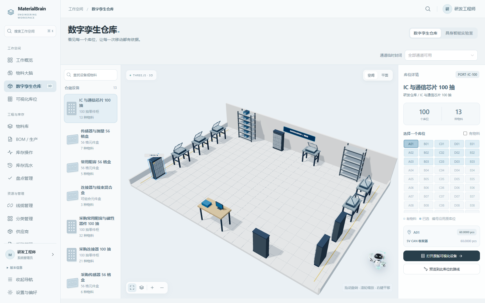
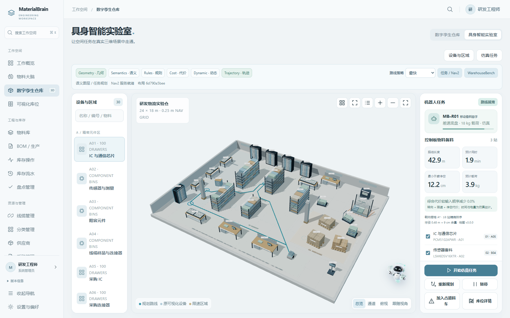
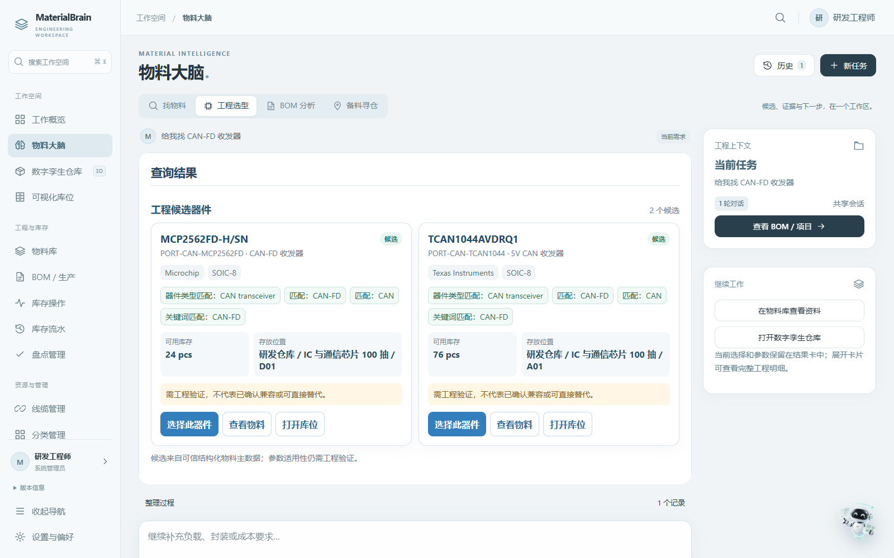
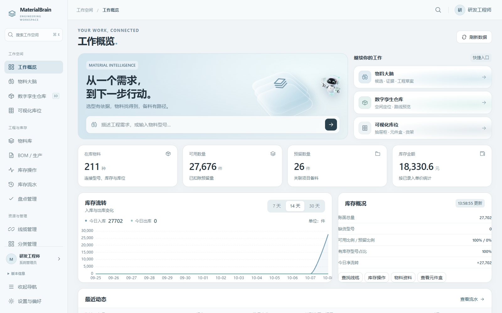
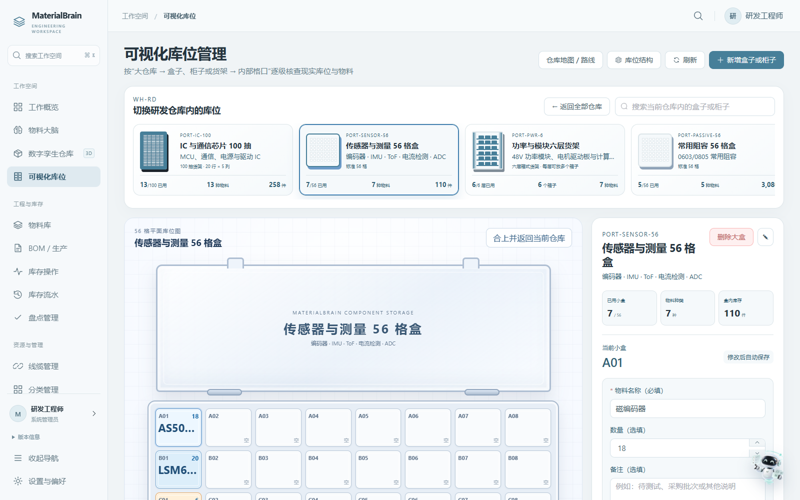
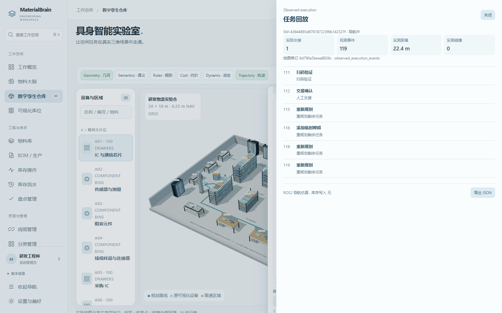

<div align="center">


# MaterialBrain

**面向工程物料与具身仓储任务的空间智能 Agent。**

通过类型化工具与可检查的任务状态，连接工程需求、数据手册证据、BOM、库存库位、语义地图和机器人任务。

[](https://github.com/Yvniverse/MaterialBrain-public/actions/workflows/public-ci.yml)
[](LICENSE)
[](docs/ROBOTICS.md)

[**English**](README.md) · [架构](docs/architecture/README.md) · [空间 Agent](docs/SPATIAL_AGENT.md) · [机器人执行](docs/ROBOTICS.md) · [WarehouseBench](docs/WAREHOUSEBENCH.md)

</div>



<div align="center"><sub>数字孪生仓库 · 注册设备、库位与空间信息</sub></div>

<table><tr>
<td width="50%"><br/><sub>具身智能实验室</sub></td>
<td width="50%"><br/><sub>工程物料大脑</sub></td>
</tr></table>

## 项目介绍

MaterialBrain 将**工程物料智能**和**机器人空间任务执行**整合到同一套可自托管应用中。Agent 将需求转成类型化任务；服务端负责物料事实、库存事务、几何约束和执行状态。工作台与悬浮助手在工作空间中共享对话状态。


## 核心能力

| 模块 | 产品能力 |
| --- | --- |
| **工程物料大脑** | 依据数据手册证据、器件属性、电气约束、库存库位与 BOM 要求比较候选器件。 |
| **库存与可视化库位** | 管理物料、预留和授权库存事务；查看 100 抽柜、56 格元件盒及六层货架。 |
| **三维数字孪生仓库** | 使用 Three.js 浏览仓库，选中设备、定位库位并预览路线。 |
| **约束空间规划** | 查询版本化 PostGIS 地图，规划受载荷、时间窗、电量和语义通行约束的多站任务。 |
| **任务图与恢复** | 查看类型化技能结果、导航、扫码交接、已完成站点、取消和重规划状态。 |
| **机器人导航执行** | 使用 ROS2 Jazzy / Nav2，通过 Smac State Lattice、MPPI 和 Behavior Tree 运行仿真导航与恢复。 |
| **WarehouseBench** | 生成带种子的合成任务、验证路线、导出轨迹，并使用可移植的本地模型 SFT 接口。 |

## 产品界面

<table><tr>
<td width="50%"><br/><sub>工作空间与库存概览</sub></td>
<td width="50%"><br/><sub>抽屉柜、元件盒、货架与库位选择</sub></td>
</tr></table>

### 数字孪生仓库与具身导航

数字孪生仓库将注册仓储设备和具身智能实验室放在同一个工作空间。实验室使用**版本化的 24 × 18 m 合成仓库**，包含异构仓储设备和注册停靠点。场景展示机器人、路线与任务状态；任务规划和 Nav2 执行观测分别记录。



进入“数字孪生仓库”，切换到“具身智能实验室”，选择目标并检查路线，再明确启动仿真任务。到达、扫码交接、障碍变化、重规划和返航会记录在任务时间线中。`/warehouse-lab` 兼容深链接会跳转到同一实验室；统一入口为 `/warehouse-twin?workspace=robot-lab`。

## 技术架构与执行边界

| 层级 | 主要技术 |
| --- | --- |
| 前端 | Vue 3、TypeScript、Element Plus、Three.js、ECharts |
| 后端与服务 | FastAPI、SQLAlchemy、PostgreSQL 17、PostGIS |
| Agent 与规划 | LangGraph、可选 Qwen 集成、类型化工具、OR-Tools |
| 机器人 | ROS 2 Jazzy、Nav2 State Lattice、MPPI、Behavior Tree |
| 训练与评测 | WarehouseBench、确定性验证、重放、PyTorch / PEFT SFT 接口 |

库存变化通过授权库存事务完成。公开机器人服务运行在**仿真模式**，报告 `hardware_control=false` 和 `inventory_written=false`。规划估计与机器人执行测量使用独立字段。

## 快速开始

需要 Docker Engine 和 Compose v2。源码开发使用 Python 3.12、Node.js 22 与 pnpm 11。

```bash
git clone --branch codex/public-v0.2-spatial-agent https://github.com/Yvniverse/MaterialBrain-public.git
cd MaterialBrain-public
cp .env.example .env
```

在 `.env` 中设置 `POSTGRES_PASSWORD`，同步修改 `DATABASE_URL` 的密码；具有 URL 特殊含义的字符需要进行 URL 编码。默认项目为 `materialbrain_public_v02`，浏览器端口为 `18080`，本地文件保存在 `./storage`。

```bash
docker compose -p materialbrain_public_v02 up -d --build
docker compose -p materialbrain_public_v02 exec backend python scripts/create_admin.py
docker compose -p materialbrain_public_v02 exec backend python scripts/register_spatial_map.py --expected-database-name materialbrain_public
```

后端会在启动时应用数据库迁移。打开 [http://localhost:18080](http://localhost:18080)，登录并修改初始密码。示例地图注册命令加入 `MB-EMB-LAB-03`，不会将它启用为业务仓库地图或修改库存。如果修改了 `POSTGRES_DB`，请在 `--expected-database-name` 中使用同一名称。

需要可选 ROS2/Nav2 仿真时：

```bash
docker compose -p materialbrain_public_v02 --profile robotics up -d --build robotics
```

仿真器使用 ROS domain `147` 和内部 bridge 端口 `8766`。启动任务前先检查就绪状态。确定性空间查询与规划不需要模型凭据。使用自然语言 Agent 入口时，在 `.env` 中设置 `AGENT_ENABLED=true`，再重建后端容器：

```bash
docker compose -p materialbrain_public_v02 up -d backend
```

空间请求由确定性服务处理；可选服务端模型凭据用于模型辅助的业务请求。配置与仿真运行说明见 [部署](docs/DEPLOYMENT.md) 和 [机器人执行](docs/ROBOTICS.md)。

### 体验示例仓库

图库使用合成库存与仓储设备。在新的开发安装中，将 `.env` 的 `ENVIRONMENT` 设为 `development`，再重建后端容器。先检查初始化计划，再将数据写入明确指定的数据库：

```bash
docker compose -p materialbrain_public_v02 up -d backend
docker compose -p materialbrain_public_v02 exec -e SAMPLE_DATA_SEED_ENABLED=true backend python scripts/seed_sample_warehouse.py --expected-database-name materialbrain_public
docker compose -p materialbrain_public_v02 exec -e SAMPLE_DATA_SEED_ENABLED=true backend python scripts/seed_sample_warehouse.py --expected-database-name materialbrain_public --apply
```

加性初始化会创建示例物料、库位、BOM 和合成库存，仅支持 `development` 与 `test` 环境。样例数据配置见 [部署](docs/DEPLOYMENT.md)。

## 运行与扩展

- **架构：** [系统组件](docs/architecture/README.md) 与 [类型化 Agent 编排](docs/AGENT_ARCHITECTURE.md)。
- **空间任务：** [PostGIS 地图、路线约束与任务生命周期](docs/SPATIAL_AGENT.md)。
- **机器人仿真：** [Nav2 配置与验收场景](docs/ROBOTICS.md)。
- **训练与评测：** [WarehouseBench 生成、重放与 SFT](docs/WAREHOUSEBENCH.md)。
- **API：** [认证与接口](docs/API.md)。
- **参与开发：** [贡献流程](CONTRIBUTING.md)。

安装后端依赖后，从 `backend/` 运行确定性规划基准：

```bash
python -m warehouse_bench --seed 17 --repetitions 3 --output ../storage/benchmarks/planners
```

模型权重和生成的数据集保存在提交源码之外。可选训练入口使用已准备好的本地兼容模型目录。

## 许可证

应用与文档使用 [Apache License 2.0](LICENSE)。ROS2 子包保留 [MIT license](robot_bridge/ros2/LICENSE)；其他说明见 [NOTICE](NOTICE) 和 [素材](docs/ASSETS.md)。
