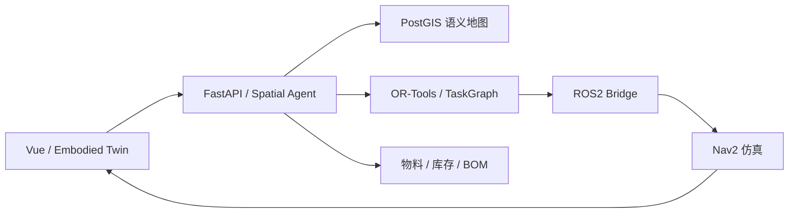

# MaterialBrain

**空间 Agent、工程物料智能与机器人仓储工作流**

MaterialBrain 把工程物料、库存库位、PostGIS 语义地图、约束任务规划和 ROS2/Nav2 仿真连接到同一套可自托管系统中。模型参与理解和解释，地图查询、路线约束、任务状态和库存事务由服务端执行。

[English](README.md) · [架构导航](docs/architecture/README.md) · [Spatial Agent](docs/SPATIAL_AGENT.md) · [机器人运行](docs/ROBOTICS.md) · [WarehouseBench](docs/WAREHOUSEBENCH.md)

## v0.2 能力

| 模块 | 作用 |
| --- | --- |
| 工程物料智能 | 数据手册页级证据、元件匹配、电源设计、Engineering BOM 和 Product BOM 只读预览。 |
| 空间地图 | PostGIS 存储语义区域、障碍、导航节点和任务停靠点；地图版本参与查询与规划。 |
| 约束规划 | 用地图连通性和 OR-Tools 规划多站任务，报告不可达、容量和其他约束。 |
| Spatial Agent | 将物料或空间请求转为可检查的计划和结构化任务卡。 |
| TaskGraph | 跟踪导航、到达和交接等不同步骤，保留执行事件与重规划状态。 |
| Embodied Twin | 在交互式孪生中查看地图、机器人位置、计划、障碍和任务进度。 |
| ROS2/Nav2 | 独立机器人仿真服务承接导航目标，返回观测状态。 |
| 模型接口 | WarehouseBench 任务生成、确定性验证、轨迹重放与可选 SFT 训练入口。 |



## 快速启动

需要 Docker Engine 和 Compose v2。源码开发使用 Python 3.12、Node.js 22 和 pnpm 11。

```bash
git clone --branch codex/public-v0.2-spatial-agent https://github.com/Yvniverse/MaterialBrain-public.git
cd MaterialBrain-public
cp .env.example .env
```

修改 `.env` 的 PostgreSQL 密码并同步 `DATABASE_URL`。默认 Compose project 为 `materialbrain_public_v02`，浏览器端口为 `18080`，文件保存在本仓库的 `./storage`。

```bash
docker compose -p materialbrain_public_v02 up -d --build
docker compose -p materialbrain_public_v02 exec backend alembic upgrade head
docker compose -p materialbrain_public_v02 exec backend python scripts/create_admin.py
```

打开 [http://localhost:18080](http://localhost:18080)，登录后进入物料、空间任务或数字孪生页面。地图注册与机器人仿真的启动步骤见 [Spatial Agent](docs/SPATIAL_AGENT.md) 和 [机器人运行](docs/ROBOTICS.md)。

确定性地图查询和规划不需要模型密钥。使用自然语言 Agent 入口时，在服务端 `.env` 设置 `AGENT_ENABLED=true`；确定性空间任务可在没有模型凭据时运行。需要模型辅助时再配置提供方凭据，密钥只传给后端。

```bash
curl http://localhost:18080/api/v1/health
```

## 试用流程

1. 读取 `MB-EMB-LAB-03` 示例地图并检查停靠点、障碍和地图版本。
2. 在 Agent 中提交多站导航请求，查看结构化计划、总距离和规划约束。
3. 打开 `/warehouse-lab`；查看目标和路线，再显式启动任务。
4. 观察 Nav2 仿真的机器人位置及任务事件。到达停靠点后，按任务要求完成扫描或交接。
5. 遇到障碍时重规划；检查已完成站点和剩余目标。

任务计划与机器人执行分开。示例运行报告 `hardware_control=false`；到达或交接事件不会自动修改库存，库存变更仍通过独立的授权事务接口完成。

## 开发与复现

[贡献指南](CONTRIBUTING.md) 包含独立 PostGIS 测试服务、后端与前端检查。空间测试依赖 PostGIS；普通 SQLite 测试不能替代几何查询和迁移验证。

[WarehouseBench](docs/WAREHOUSEBENCH.md) 介绍任务 schema、生成器、验证器、轨迹重放与 SFT 数据格式。生成的报告应保留任务配置、种子、模型设置和执行轨迹，便于比较同一任务集上的行为。

## 文档

| 主题 | 文档 |
| --- | --- |
| API 与认证 | [API](docs/API.md) |
| 空间请求、规划与任务生命周期 | [Spatial Agent](docs/SPATIAL_AGENT.md) |
| ROS2/Nav2 与孪生 | [Robotics](docs/ROBOTICS.md) |
| 模型训练与评测 | [WarehouseBench](docs/WAREHOUSEBENCH.md) |
| 六个架构视图 | [Architecture](docs/architecture/README.md) |
| 备份和恢复 | [Backup / Restore](docs/BACKUP_RESTORE.md) |
| 安全运行 | [Security](docs/SECURITY.md) |
| 素材与样例数据 | [Assets](docs/ASSETS.md) |

## 许可证

MaterialBrain 使用 [Apache License 2.0](LICENSE)，[ROS2 子包](robot_bridge/ros2/) 保留 [MIT License](robot_bridge/ros2/LICENSE)。第三方依赖和外部材料保留各自条款，见 [NOTICE](NOTICE) 和 [素材说明](docs/ASSETS.md)。
