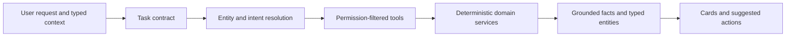

# Agent architecture

The floating conversation and `/agent` workbench share a structured backend result contract. Requests include typed selection context and, when applicable, navigation context. The backend resolves the request's domain and permissions before choosing tools.

## Tool and result contracts

`backend/app/agent/tools/registry.py` defines tool schemas and the read-only tool boundary. Ordinary material and inventory turns receive tools appropriate to those domains. Navigation-lab tools require a navigation task contract and registered world context.

The backend validates arguments, enforces user permissions, and records execution results. Grounded facts reference material, stock, location, BOM, picking, or navigation records. Typed result entities drive the corresponding Vue cards; they retain the relevant revision and identifiers.

The model may propose a supported action or compose an explanation. Inventory changes use the proposal, approval, idempotency, and transaction interfaces already defined for that operation. Spatial mission tools do not acquire inventory write permission.

## Spatial Agent

`backend/app/agent/spatial_integration.py` connects conversation requests to map resolution, deterministic mission planning, and stored mission lifecycle. `backend/app/agent/spatial_agent/` defines validated high-level skills, episode records, and TaskGraph behavior.

Navigation context carries the canonical world revision, current pose, completed destinations, remaining goals, and execution status. Stale context, ambiguous destinations, or missing execution observations produce clarification rather than a guessed restart pose.

The server validates registered goals and map revisions. Mission cards show solver outcomes and current execution state. Creating a mission and starting it are separate operations. Arrival requires an observation; completing a stop requires the expected scan and handoff.

## Conversation state

Conversation context is bounded, user-owned, and expires. Material/project selections and pending spatial work are typed fields. A switch back to a business request clears unrelated navigation context. Authentication changes reset the frontend session and subscriptions so one account cannot inherit another account's conversation.

Replanning uses the observed pose and recorded completed goals. TaskGraph dependencies and event deduplication preserve progress across repeated polls, cancellation, and transport interruption.

## Configuration

Set `AGENT_ENABLED=true` for the Agent entrypoint. Deterministic spatial planning works without model credentials. `AGENT_MODEL_POLICY=deterministic` is useful for local deterministic business checks. Model-assisted requests use server-side provider settings and bounded tool rounds/deadlines.

The supplied robot transport is simulation-only and exposes this fact in its contract. See [Spatial Agent](SPATIAL_AGENT.md) for request fields, [Robotics](ROBOTICS.md) for observed execution, and the [agent tools view](architecture/02-agent-tools.md) for source references.
