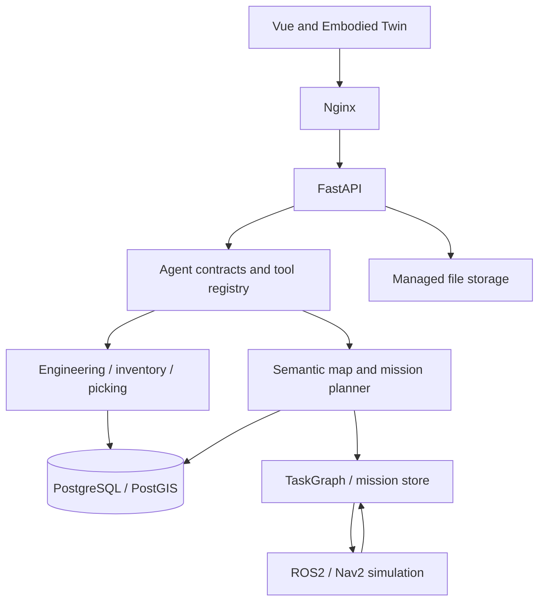

# System architecture

MaterialBrain has four cooperating layers: engineering and warehouse records, spatial planning, mission execution, and interactive agent interfaces. FastAPI owns authentication, permission checks, durable state, and domain transactions. Vue displays typed results and observations.

## Runtime

The Compose stack runs Nginx, a Vue bundle, FastAPI, PostGIS, and a backup service. The optional `robotics` profile adds the ROS2 bridge. Compose prefixes networks and volumes with the project name; storage binds resolve against the installation's configured directory. Independent installations use distinct projects, storage roots, ports, and ROS domains.

The backend applies Alembic migrations and seeds permissions at startup. Map registration is explicit unless `SPATIAL_SAMPLE_MAP_ENABLED=true`. The supplied sample map is synthetic and non-active; it does not replace an operational warehouse map or stock record.

## Domain records

Material and engineering services resolve component identifiers, evidence anchors, selection constraints, and BOM readiness. Product BOM preview computes a read-only diff. Inventory, reservation, loan, movement, and picking settlement follow transactional permission and audit paths.

Map-bound locations connect these records to a warehouse graph. Business grounding resolves a demand to known locations and registered destinations before it becomes a robot task. Missing location, stock, or BOM facts produce explicit blockers.

## Spatial planning

PostGIS stores local-metric geometry, semantic zones, docks, and active overlays. A snapshot carries the map revision and graph identity. The planner filters edges using geometry and policy, computes pairwise paths, and uses OR-Tools to order stops with time, capacity, and battery constraints.

The planner returns feasibility, violations, route segments, objective terms, and estimates. A model may select registered high-level goals or explain a result; it does not set an unvalidated coordinate target or redefine map facts.

## Execution

Mission creation persists a reviewed plan and TaskGraph without dispatching movement. Starting a mission checks owner access, revision, transport, and Nav2 readiness. Polling reduces observed events into mission state using stable event IDs and monotonic sequence numbers.

Navigation arrival, scan verification, and human handoff are separate steps. Cancellation and replanning preserve completed work. The supplied bridge controls a simulated differential-drive base and reports its execution boundary in responses.

## Reproducibility

WarehouseBench supplies seeded tasks and independent route verification. Synthetic training export freezes a map and skill contract, separates related groups across splits, and records file hashes. Replay verifies each state transition. Optional SFT consumes that verified dataset and local model weights.

Detailed views and source links are in the [architecture atlas](architecture/README.md). See [Agent architecture](AGENT_ARCHITECTURE.md), [Spatial Agent](SPATIAL_AGENT.md), [Robotics](ROBOTICS.md), and [Database](DATABASE.md) for implementation contracts.
