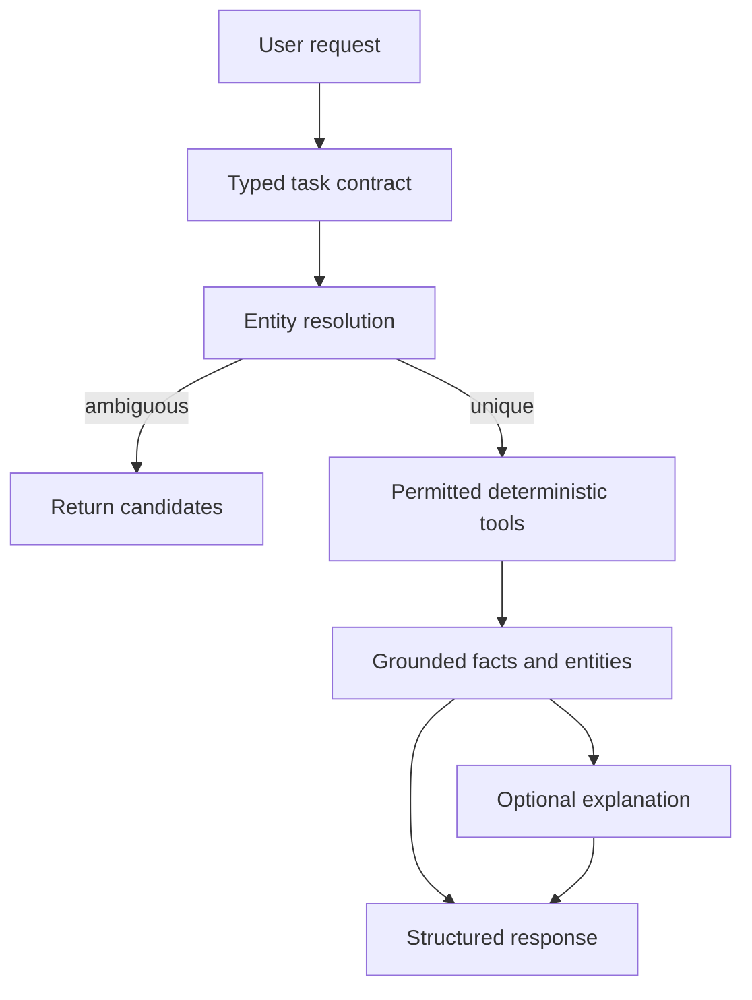

# Deterministic orchestration

The server extracts a task contract for high-confidence requests, resolves identifiers, and runs the required fact tools. This reduces repeated model decisions while preserving permission and ambiguity checks.

## Request flow

The task contract records requested facts, entity context, write intent, and capability limits. It is an execution input, not a hidden reasoning transcript.

## Fact execution

| Resolved request | Server operation |
| --- | --- |
| Material availability | Query inventory and reservations. |
| Material location | Query registered locations and lot coverage. |
| Project BOM | Read the requested BOM version. |
| Project stock sufficiency | Compare total demand with available stock and that project's reservations. |
| Spatial destination or multi-stop task | Resolve semantic docks, query the current map, and invoke constrained planning. |
| Write request | Build a supported proposal or action contract, then require its authorization path. |

When multiple candidates remain, return the candidates and wait for an explicit selection. Do not infer an ID from list order or model confidence.

Tool schemas are pruned to the current operation. A resolved identifier should be passed directly to the required tool rather than asking the model to rediscover it. Simple deterministic responses may skip a narrative provider call.

## State and limitations

Conversation state stores typed selections and contracts. A follow-up can reuse valid context, but must recheck mutable facts and map versions before execution.

Project BOM total demand and product quantity per unit are distinct. Missing package, attribute, location, or evidence data remains unknown. The agent must not invent an opened package, exact lot count, calibration result, or physical arrival.

Spatial execution adds a TaskGraph: plan creation, navigation, arrival, scan, and handoff are separate steps. Observed mission events determine progress. A completed navigation goal cannot substitute for a handoff event.

## Tests

Tests should assert observable behavior: deterministic tool selection after unique resolution, no entity-specific execution after ambiguity, permission checks, provider failure handling, current-state revalidation, and no writes before authorization. Compare task outcomes and traces using [WarehouseBench](WAREHOUSEBENCH.md).
