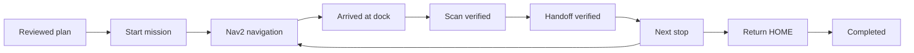

# Robotics and Embodied Twin

The robotics profile runs ROS2 Jazzy and Nav2 against a synthetic warehouse. A differential-drive simulation consumes velocity commands and publishes odometry, transforms, laser scans, and navigation feedback. The backend owns mission plans and user access; the bridge owns Nav2 actions.

## Start the robot service

Use the same explicit public Compose project as the web application:

```bash
docker compose -p materialbrain_public_v02 --profile robotics up -d --build robotics
```

The default ROS domain is `147`. The bridge listens on internal port `8766` at `http://robotics:8766`; it has no host port mapping. Observed topics and events are written under the installation's `storage/robotics/` directory.

Each independent robotics test instance needs its own Compose project, ROS domain, and output directory. Set those in its environment file before starting it.

Read readiness through `GET /api/v1/spatial/navigation/health` after logging in. Health reports the current map revision, active Nav2 plugins, lifecycle state, sensor counts, transport, and robot state. A reachable HTTP endpoint alone is insufficient to dispatch a mission.

## Navigation stack

The configured global planner is `SmacPlannerLattice`. The controller uses Rotation Shim with MPPI and the differential-drive model. A footprint-aware simulated base and costmaps use the canonical robot/world geometry. Synthetic localization supplies the map-to-odometry transform.

The source world, semantic snapshot, raster map, and robot footprint must use compatible units and revision identities. The bridge checks registered goals and server-provided route segments before dispatch.

Implementation and low-level configuration are in [robot_bridge/ros2](../robot_bridge/ros2/README.md).

## TaskGraph and observations



Open `/warehouse-lab` to view the Embodied Twin. The existing warehouse twin also supports `/warehouse-twin?workspace=robot-lab`. Mission cards retain the plan, map revision, robot pose, completed stops, current skill, and remaining work.

Arrival and material handling are separate. Handoff requires the registered arrived goal and a matching scan value. TaskGraph applies events using stable IDs and monotonic sequences, so repeated polling does not repeat a handoff.

Cancellation holds the simulated base and requests Nav2 cancellation. Transport interruption pauses progress. Replanning waits for the previous action to terminate, uses current observed state, and preserves completed work. An explicit replan may resume an eligible paused mission without recreating completed handoffs.

## Simulation limits

The service reports `execution_boundary=ros2_nav2_simulation` and `hardware_control=false`. Its base, localization, laser, battery consumption, and charging are simulated. It contains no physical motor driver. A simulation result describes this environment and cannot establish physical handling or site calibration.

`inventory_written=false` remains part of the mission contract. Use authorized inventory/picking workflows for stock settlement.

## Validation

Run the provided acceptance scenarios on an idle, dedicated simulation instance. For example:

```bash
docker compose -p materialbrain_public_v02 --profile robotics exec -T robotics bash -lc 'source /opt/ros/jazzy/setup.bash; source /opt/materialbrain/ros2/install/setup.bash; python3 /opt/materialbrain/ros2/scripts/acceptance.py --scenario nominal'
```

The acceptance runner also supports obstacle recovery, cancellation, low-battery handling, and charging scenarios. Inspect both scenario assertions and observed topic/event records. The [WarehouseBench guide](WAREHOUSEBENCH.md) explains how measured Nav2 output can be imported alongside planner reports.
