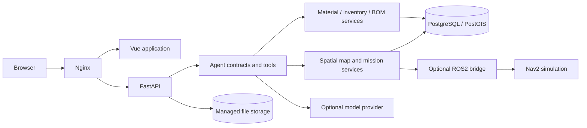

# Runtime

The web application uses a same-origin entry point. FastAPI authenticates requests and invokes domain or spatial services. PostgreSQL/PostGIS stores persistent application and geometry state; managed files use installation-local storage.

Compose scopes networks and volumes to the installation project. The default browser port is `18080`; the database and robot HTTP service stay inside the application network. Test deployments use a separate project and loopback database port.

Model-provider keys remain in the backend. Geometry and stock are read from deterministic services; provider output cannot update them. The robotics service accepts server-owned mission plans and reports simulation observations.

Source: [Compose](../../docker-compose.yml), [FastAPI application](../../backend/app/main.py), [frontend](../../frontend/src/), [spatial services](../../backend/app/spatial/).

Next: [Agent and tools](02-agent-tools.md) · [Spatial Agent guide](../SPATIAL_AGENT.md)
