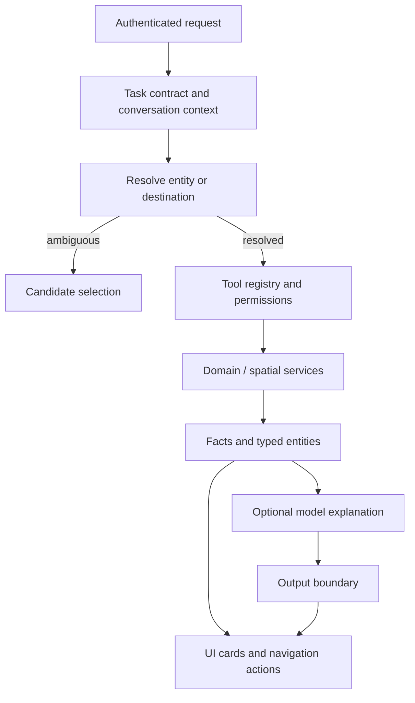

# Agent and tools

Requests enter through the authenticated API. A typed task contract describes the requested facts and context. Entity resolution and the registered tool set determine which services may run.

The frontend receives stable entity identifiers and typed actions. It does not derive writes or navigation targets from free-form prose. Conversation state retains explicit selections; mutable inventory and map facts are rechecked when used.

Read tools cannot authorize mutations. Proposals and robot mission controls use their own action paths, permission checks, and state validation.

Source: [agent runtime](../../backend/app/agent/), [tool registry](../../backend/app/agent/tools/registry.py), [agent schemas](../../backend/app/schemas/agent.py), [spatial agent](../../backend/app/agent/spatial_agent/).

Next: [Agent development](../AGENT_DEVELOPMENT.md) · [Deterministic orchestration](../DETERMINISTIC_ORCHESTRATION_SPEC.md)
