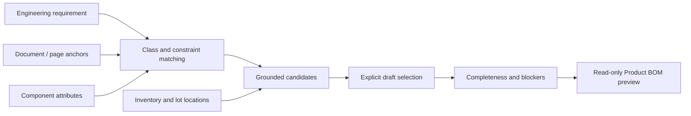

# Engineering materials

Engineering queries combine requirements with structured component attributes and managed document evidence. Identity, specification, stock, and location have independent provenance.

The server calculates power losses, matching status, draft completeness, and BOM differences. Missing evidence or attributes remain unknown. A compatible in-stock component is not automatically selected.

Draft selection and Product BOM application are separate operations. A preview reports `ADD`, `UPDATE_QUANTITY`, `NO_CHANGE`, or `UNRESOLVED`; the preview itself does not mutate the formal BOM.

Stock and lot coverage remain operational facts. Sample quantities retain their synthetic source metadata, and a primary location alone cannot prove an exact quantity at that location.

Source: [component intelligence](../../backend/app/component_intelligence/), [power services](../../backend/app/services/power_design.py), [engineering evidence](../../backend/app/services/engineering_evidence.py), [BOM preview](../../backend/app/services/product_bom_preview.py).

Next: [API](../API.md) · [Spatial planning](04-spatial-planning.md)
