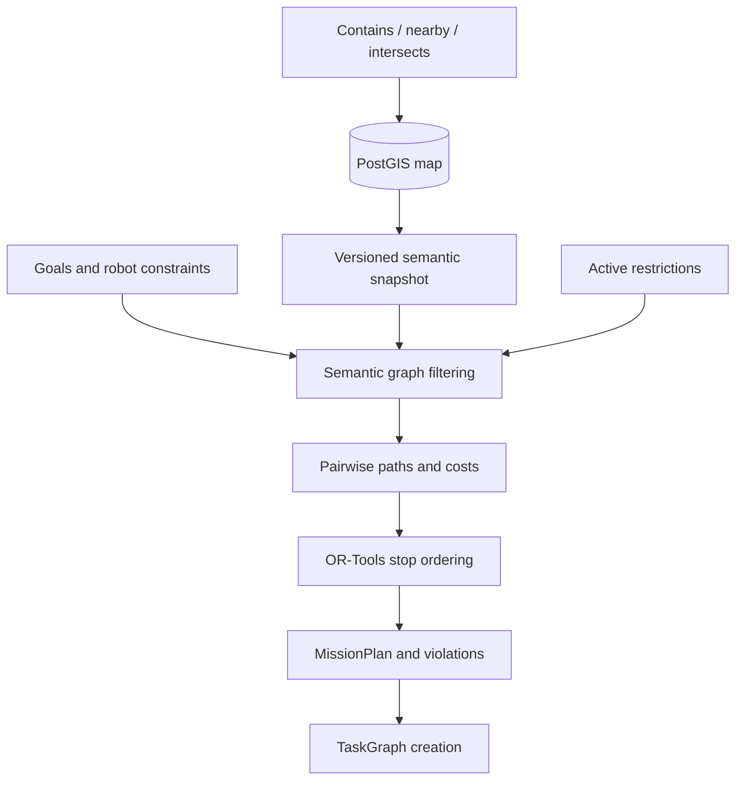

# Spatial planning

The semantic map joins geometry with navigable graph edges, zones, docks, affordances, and dynamic restrictions. Queries use PostGIS predicates over the persisted map. Mission planning uses a versioned snapshot.

Profiles choose speed, risk, or ESD policy costs. Payload, battery reserve, service times, and time windows constrain mission feasibility. A plan carries its map revision and named solver status; an infeasible request returns violations rather than invented targets.

Routes use registered destinations and a collision-checked connector from the observed start pose. The planning result describes graph paths and estimated resource use. Nav2 separately produces and executes motion trajectories.

Source: [map service](../../backend/app/spatial/service.py), [snapshot](../../backend/app/spatial/snapshot.py), [mission planner](../../backend/app/services/spatial_mission/), [contracts](../../backend/app/schemas/spatial.py).

Next: [Spatial Agent guide](../SPATIAL_AGENT.md) · [TaskGraph and robotics](05-taskgraph-robotics.md)
