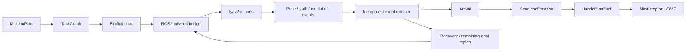

# TaskGraph and robotics

A mission plan creates a dependency graph. Each task stop requires navigation, scan confirmation, and handoff verification. A requested return-home step follows the completed stops.

The bridge derives goals and route waypoints from registered map identities. ROS2 publishes odometry, laser scans, transforms, and path feedback. Event IDs and monotonic sequences let the backend apply observations without duplicating progress.

An arrival event alone does not complete a handoff. Cancellation and transport interruption retain completed work; replanning uses the observed pose and remaining goals. The supplied transport reports `ros2_nav2_simulation`, `hardware_control=false`, and `inventory_written=false`.

Source: [TaskGraph reducer](../../backend/app/agent/spatial_agent/task_graph.py), [spatial transport](../../backend/app/services/spatial_transport.py), [ROS2 bridge](../../robot_bridge/ros2/materialbrain_ros2/), [Embodied Twin](../../frontend/src/embodied/).

Next: [Robotics guide](../ROBOTICS.md) · [Model training and evaluation](06-model-training.md)
