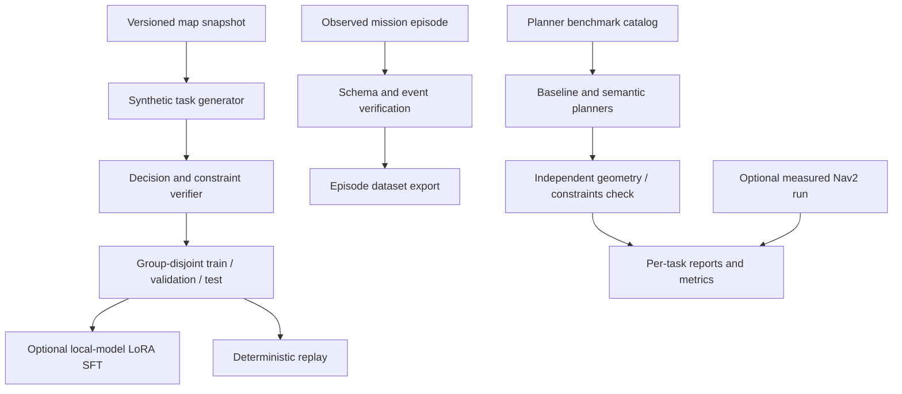

# Model training and evaluation

WarehouseBench provides planner tasks and independent route verification. The training interface generates synthetic decision records from a versioned snapshot. Observed mission episodes provide a separate replay source.

Synthetic decisions and observed execution are different data sources. A planned path is evaluated as a plan; measured execution requires recorded robot topics and events. Infeasibility classification, successful planning, and completed missions are reported separately.

The SFT entrypoint takes a local model path and generated data. Optional training dependencies are separate from application dependencies. Training receipts record the snapshot, input hashes, configuration, and checkpoints so runs can be compared.

Source: [WarehouseBench](../../backend/warehouse_bench/), [episode exporter](../../backend/app/agent/spatial_agent/dataset.py), [training modules](../../training/materialbrain_training/), [SFT entrypoint](../../training/train_sft.py).

Next: [WarehouseBench guide](../WAREHOUSEBENCH.md)
